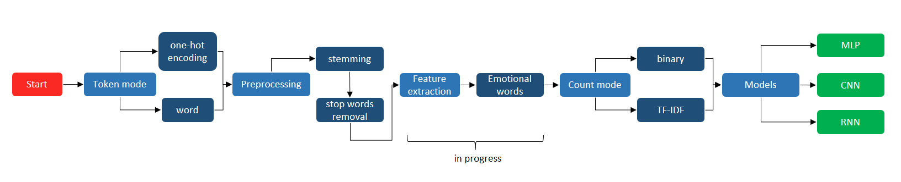

# Cross-Domain Sentiment Analysis Algorithm: A Guide

This repository contains a structure to apply the idea of sentiment analysis for different kinds of subjects or domains. Our code has been developed in Python 3 with some help from the following libraries.
 
 * NLTK
 * Keras
 * Scikit-Learn
 * GloVe
 
The dataset we use was the following:
 
 * Amazon Reviews for Sentiment Analysis (https://www.kaggle.com/bittlingmayer/amazonreviews)
 * Movie Review Data (http://www.cs.cornell.edu/people/pabo/movie-review-data/)
 
So we are going to explain how to use it and the first step is to get the data and process it.
 
The project process is simplified in the following figure. While the feature extraction definitions are in progress, most have already been defined. 
 
 
 
 ## Preprocessing
 
First things firsts, let's get the data. We chose the using of a class to represent our data in Python. So, we has created the *Dataset* class. This class should standardize our data, because from different datasets we have different formats of data, and here we have a pattern, just the data and its labels.

### *Dataset* class

```
class Dataset:
    def __init__(self):
        self.docs = []
        self.labels = []
```

#### Inserting a data in our dataset
The documents are in a array and so is labels. Just that. Simple, isn't it? For that class we have some methods as well, like *add()*, which insert a data in our dataset, of course. This method just receive a *Data* class as parameter and put it on out dataset. Have I not told you about the *Data* class yet? Oh, forgive me. The *Data* class has two attributes, the text data and its label, and represents a single unity of data. See the following example.

```
text = "I love this tutorial"
label = 1
data = Data(doc=text, label=label)
dataset.add(data)
```
Do not forget that the label is always binary, 0 for negatives and 1 for positives.

#### Getting our training and testing data
We have also a second method called *get_train_test()* and guess it... You're right! It divide our dataset in train and test. So you can ask me if you can get just a part of the entire dataset, yes, you can! This method receive as parameters the number of docs you want to get and the percentage of the division. Let's see an example:

```
x_train, y_train, x_test, y_test = dataset.get_train_test(0.2, 1000)
```

Here we are asking for a data sample of 1000 documents and 20% of it is for training and the rest is for test. Oh, so simple, I know you have already got it.

#### Saving into a CSV file
"Oh, Turorial, and if I would like to save in a CSV file?" There's no problem. The class method *save_to_csv()* generates a CSV file with all your dataset. See the example below.

```
dataset = getData()
dataset.save_to_csv()
```
This method will create a CSV file with two columns: data and label. The first one contain the tokenized texts and the second, its correspondent label. Each row contains a different data text.

```
data                                     label

this tutorial is awesome                 1
this tutorial does not explain anything  0
```

### Amazon and Movie Review preprocessing

You don't have to understand the magic that happens inside of our *py* files but it's cool see an overview about how we process the data. Ok, let's go. It will be fast.

After we get the text and its labels from the document, we separate it in tokens. So, we delete the stop words from text and lemmatize it. The data you will receive when calls the function will be divided by tokens, as a vector of words.

But you just must have the *AmazonDatasetTest.txt* and calls the function. See an example.

```
dataset = AmazonDatasetProcessing.getData()
```
It will return to you the entire Amazon dataset as a *Dataset* class. So, you will have a dataset with 400k texts and its labels. Is it too much for you? Don't worry. Use the *Dataset* class method, *get_train_test()*, and put the percentage of test and train and how much data you want, as I've already showed you. The same thing you can do with Movie Review dataset.

### Emotional words

Getting the emotional words is the first of our feature extraction. Basically, the emotional words of a corpus are the word which appear most frequently in one kind of label. The function who test if a term is a emotional word is the following.

*F(w) = (L1, l2)*

**F** represents a tuple of values and **w** a word. The tuple ***(L1, L2)*** is formed by ***L1***, the frequence of the word ***w*** appears in label negative, and ***L2***, the frequence of the word ***w*** appears in label positive. Having the tuple of the entire dataset, we test it.

*p(w) = L1/(L1+L2)
n(w) = L2/(L1+L2)*

Here we have the frequence of the word ***w*** appears in each label (p to positives and n to negatives) in percentage. Ok, we just jave to check if *difference = p(w)-n(w)* is bigger than 0.4 (this threshold can vary according to the preferences).

To use that function in our code, we just call the function passing the data, its labels and the threshold.

```
dictionary = getEmotionalWords(x_train, y_train, word_precision=0.7)
```

## Building a RNN

### Getting the data
Now we are explain how we wrote the code in *recurrent_classifier.py* that implements a Recurrent Neural Network to classify our datasets. So, step by step, we will use our before-explained class and methods to favor us. Let's do this.

First of all let's get our Amazon Dataset with the function *getData()* from *AmazonDatasetPreprocessing.py* and it will return to us a vector of documents where each element is a text. After that, let's get a sample of this dataset, with 50k documents, divided as 30% for tests and the rest for train.
```
dataset = getData()
x_train, y_train, x_test, y_test = dataset.get_train_test(0.3, 50000)
```
### Extracting the features
Then, we will extract the emotional words to build our own dictionary, with the important words for our work. 
```
dictionary = getEmotionalWords(x_train, y_train, word_precision=0.7)
```
After that, let's convert our vectors to a Numpy array to put in the Keras neural networks, and save some important informations from our data in variables.
```
y_train = np.array(y_train)
y_train = keras.utils.to_categorical(y_train, 2)
data_size = len(x_train)
num_of_words = len(dictionary
```

### Getting the binary vector
We could use the Keras function *sequences_to_matrix()* to convert each text of our dataset to a vector of 0s and 1s. However, this function does not accept a customized dictionary, as the one obtained from our *getEmotionalWords()* function. So, we have developed our own *sequences_to_matrix()* function.
```
x_train = text_to_binary(x_train, dictionary)
x_train = np.array(x_train)
```

### Building the network
In this step we build our neural network with embeddings, dropout, LSTM and dense layers. We used the *sigmoid* and *softmax* for activation functions.
```
model_conv = Sequential()

model_conv.add(Embedding(num_of_words, 100, input_length=num_of_words))
model_conv.add(Dropout(0.2))
model_conv.add(LSTM(100))
model_conv.add(Dropout(0.2))
model_conv.add(Dense(2, activation='sigmoid', input_shape=(num_of_words, )))

model_conv.compile(loss='binary_crossentropy', optimizer='adam', metrics=['accuracy'])
model_conv.fit(x_train, y_train, verbose=1, epochs=3)
```
